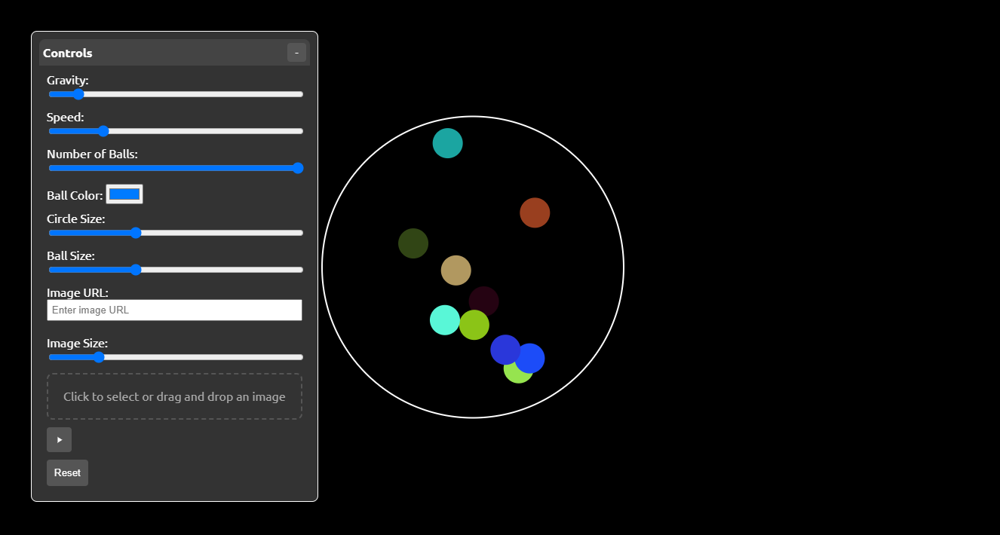

# Ball Bouncing Thing
Like those youtube shorts and reels

This project simulates balls bouncing within a circular boundary. Users can interact with the simulation by dragging and dropping balls, adjusting various parameters, and uploading images to be displayed on the balls.

## Features

- Drag and drop balls within the circular boundary.
- Adjust gravity, speed, number of balls, ball color, circle size, and ball size using the control panel.
- Upload images to be displayed on the balls.
- Pause and reset the simulation.

## Screenshot




## Installation

1. Clone the repository:
    ```sh
    git clone https://github.com/yourusername/Ball-Bouncing-Thing.git
    ```
2. Navigate to the project directory:
    ```sh
    cd Ball-Bouncing-Thing
    ```

## Usage

1. Open [`index.html`](index.html) in your web browser.
2. Use the control panel to adjust the simulation parameters:
    - **Gravity**: Adjust the gravity affecting the balls.
    - **Speed**: Adjust the initial speed of the balls.
    - **Number of Balls**: Adjust the number of balls in the simulation.
    - **Ball Color**: Change the color of the balls.
    - **Circle Size**: Adjust the size of the circular boundary.
    - **Ball Size**: Adjust the size of the balls.
    - **Image URL**: Enter a URL to an image to be displayed on the balls.
    - **Image Size**: Adjust the size of the image displayed on the balls.
    - **Upload Image**: Click to select or drag and drop an image file to be displayed on the balls.
    - **Pause**: Pause or resume the simulation.
    - **Reset**: Reset the simulation to its initial state.

## File Structure

.gitattributes assets/ script.js style.css index.html LICENSE README.md

- [`index.html`](index.html): The main HTML file that contains the structure of the web page.
- [`assets/script.js`](assets/script.js): The JavaScript file that contains the logic for the simulation.
- [`assets/style.css`](assets/style.css): The CSS file that contains the styles for the web page.
- [`.gitattributes`](.gitattributes): Git configuration file.
- [`LICENSE`](LICENSE): The license file for the project.
- [`README.md`](README.md): This readme file.

## Live Demo

You can view a live demo of the project hosted on GitHub Pages: [Ball Bouncing Thing](https://pakkid.github.io/Ball-Bouncing-Thing/)

## License

This project is licensed under the MIT License. See the [`LICENSE`](LICENSE) file for details.

## Acknowledgements

- [Iconify](https://iconify.design/) for the icons used in the control panel.

Enjoy the simulation!